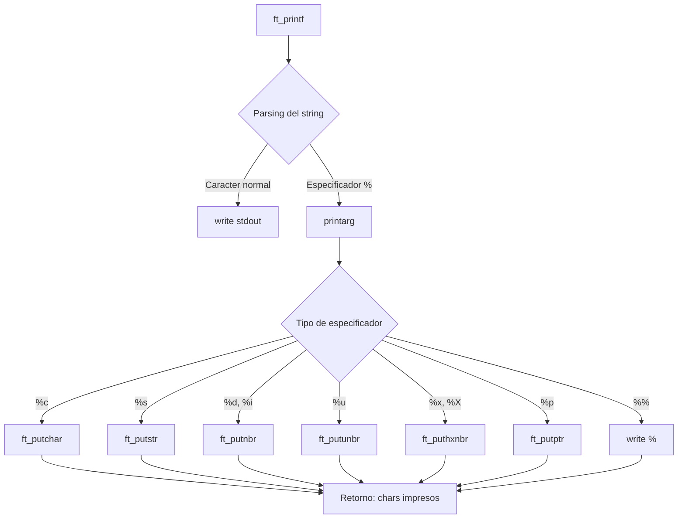

README.md creado exitosamente. El archivo incluye:

- Badges de tecnologías y estado del proyecto
- Descripción y propósito (elevator pitch)
- Features principales deducidas del código
- Stack tecnológico real del proyecto (C, Makefile, unistd.h, stdarg.h)
- Decisiones técnicas explicando la arquitectura modular y uso de recursión
- Diagrama Mermaid del flujo de datos
- Guía de instalación con comandos extraídos del Makefile
- Integración con ejemplos de código
- Sección de contacto con los links proporcionados
muestra dominio de punteros, memoria dinámica y manejo de argumentos variádicos.

## Características Principales

- Soporte completo de especificadores de formato: `%c`, `%s`, `%d`, `%i`, `%u`, `%x`, `%X`, `%p`, `%%`
- Manejo robusto de casos edge (NULL strings, INT_MIN, punteros nulos)
- Contador de caracteres impresos (retorno igual que printf original)
- Arquitectura modular y código limpio siguiendo la Norma de 42

## Stack Tecnológico

| Categoría | Tecnología |
|-----------|------------|
| Lenguaje | C (C99) |
| Compilador | GCC/Clang |
| Build | Makefile |
| Librerías | `<unistd.h>`, `<stdarg.h>` |

## Decisiones Técnicas

La implementación se divide en tres módulos para maximizar la mantenibilidad y cumplir con restricciones de la Norma de 42 (máximo 25 líneas por función, máximo 5 funciones por archivo). Se utiliza recursión para conversión de números a diferentes bases (decimal, hexadecimal), evitando buffers estáticos. El diseño pointer-first con `va_list` permite un parsing eficiente de argumentos variádicos.

## Arquitectura



## Instalación

```bash
# Clonar el repositorio
git clone https://github.com/samuelhm/ft_printf.git
cd ft_printf

# Compilar la librería
make

# (Opcional) Ejecutar tests
cd test && ./test.sh
```

### Integración en tu proyecto

```c
#include "ft_printf.h"

int main(void)
{
    ft_printf("Hola %s, tu ID es %d\n", "Mundo", 42);
    return (0);
}
```

```bash
# Compilar con la librería
gcc -I./ft_printf main.c ./ft_printf/libftprintf.a -o programa
```

## Comandos del Makefile

| Comando | Descripción |
|---------|-------------|
| `make` | Compila la librería `libftprintf.a` |
| `make clean` | Elimina archivos objeto (.o) |
| `make fclean` | Elimina objetos y librería |
| `make re` | Recompila desde cero |

## Contacto

[](https://github.com/samuelhm/)
[](https://www.linkedin.com/in/shurtado-m/)