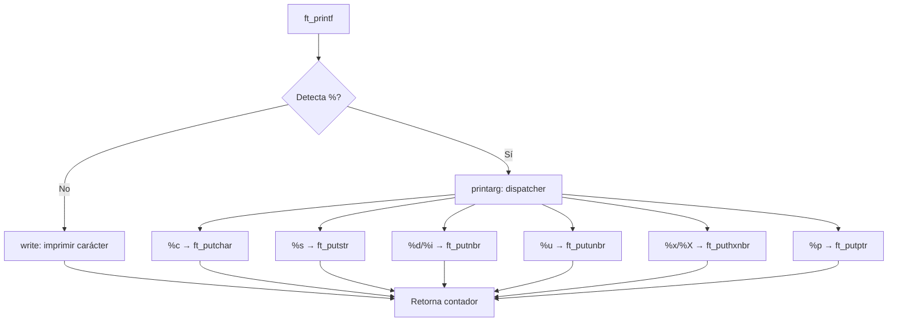

# ft_printf


## Descripción

Reimplementación de la función `printf` de la biblioteca estándar de C. Este proyecto demuestra dominio de **argumentos variádicos**, **manejo de punteros** y **programación recursiva**, produciendo una biblioteca estática lista para integrar en otros proyectos.

## Características

- Soporte completo de especificadores de formato: `%c`, `%s`, `%d`, `%i`, `%u`, `%x`, `%X`, `%p`, `%%`
- Retorno del número de caracteres impresos (comportamiento idéntico a `printf` original)
- Manejo robusto de casos edge: strings NULL, INT_MIN, punteros NULL `(nil)`
- Biblioteca estática compilada con flags estrictos (`-Wall -Wextra -Werror`)
- Código modular y reutilizable

## Stack Tecnológico

| Categoría | Tecnología |
|-----------|------------|
| Lenguaje | C (C99) |
| Build System | Makefile |
| Output | Biblioteca estática (`libftprintf.a`) |

## Decisiones Técnicas

La arquitectura modular separa el parseo de la cadena de formato de la lógica de impresión, utilizando punteros a funciones implícitos y recursividad. El uso de `va_list` permite procesar un número variable de argumentos, mientras que las funciones auxiliares delegadas a archivos separados mejoran la mantenibilidad y reducen la complejidad ciclomática. Esta estructura facilita la extensión a nuevos especificadores sin modificar el flujo principal.

## Diagrama de Arquitectura



## Instalación

```bash
# Clonar el repositorio
git clone https://github.com/samuelhm/ft_printf.git
cd ft_printf

# Compilar la biblioteca
make

# Limpiar archivos objeto
make clean

# Limpiar todo (incluye biblioteca)
make fclean

# Recompilar desde cero
make re
```

### Uso en tu proyecto

```c
#include "ft_printf.h"

int main(void)
{
    ft_printf("Hola %s! Número: %d\n", "mundo", 42);
    return (0);
}
```

```bash
# Compilar tu proyecto con la biblioteca
cc tu_programa.c -L. -lftprintf -o tu_programa
```

## Contacto

[](https://github.com/samuelhm/)
[](https://www.linkedin.com/in/shurtado-m/)