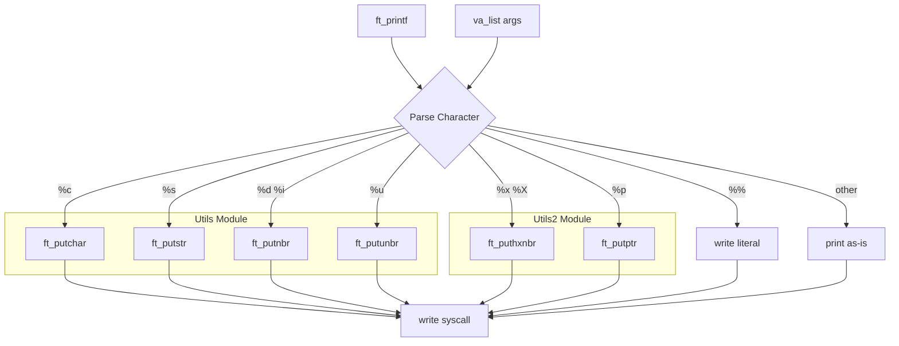

# ft_printf


## Descripción

Implementación propia de la función `printf` de la biblioteca estándar de C. Este proyecto reconstruye desde cero una de las funciones más complejas de la libc, utilizando llamadas de sistema de bajo nivel y algoritmos recursivos para el formateo de salida sin depender de funciones de biblioteca externas.

## Características Principales

- Conversión de caracteres individuales (`%c`)
- Impresión de cadenas de caracteres (`%s`) con manejo de NULL
- Números enteros con signo (`%d`, `%i`) incluyendo INT_MIN
- Números enteros sin signo (`%u`)
- Conversión a hexadecimal minúscula y mayúscula (`%x`, `%X`)
- Impresión de punteros con formato hexadecimal (`%p`)
- Símbolo de porcentaje literal (`%%`)
- Retorno del número total de caracteres impresos
- Manejo robusto de casos edge y cadenas NULL

## Stack Tecnológico

| Categoría | Tecnología |
|-----------|------------|
| Lenguaje | C (C99) |
| Build System | Makefile |
| Librería | Static Library (.a) |
| Funciones Clave | `write()`, `va_list`, `va_start`, `va_arg`, `va_end` |

## Decisiones Técnicas y Arquitectura

La arquitectura del proyecto se divide en tres módulos claramente separados siguiendo el principio de responsabilidad única. El módulo principal (`ft_printf.c`) gestiona el parsing del string de formato y el dispatch de argumentos mediante una tabla de dispatch interna. Los módulos auxiliares (`ft_printf_utils.c`, `ft_printf_utils2.c`) encapsulan la lógica de conversión numérica utilizando **algoritmos recursivos**, lo que permite un código más limpio y evita el uso de buffers temporales. Se utilizó exclusivamente la syscall `write()` para la salida, eliminando cualquier dependencia de `stdio.h` y demostrando comprensión profunda de operaciones de I/O a nivel de sistema. El resultado se empaqueta como biblioteca estática, facilitando su integración como dependencia en otros proyectos.

## Diagrama de Arquitectura



## Instalación

```bash
# Clonar el repositorio
git clone https://github.com/samuelhm/ft_printf.git
cd ft_printf

# Compilar la biblioteca estática
make

# Limpieza de archivos objeto (opcional)
make clean

# Limpieza completa (opcional)
make fclean

# Recompilar desde cero (opcional)
make re
```

### Uso en otros proyectos

```c
#include "ft_printf.h"

int main(void)
{
    ft_printf("Hola %s! El número es %d\n", "mundo", 42);
    return (0);
}
```

```bash
# Compilar tu proyecto con la biblioteca
cc -o mi_programa mi_programa.c -L. -lftprintf
```

## Estructura del Proyecto

```
ft_printf/
├── ft_printf.h          # Header con prototipos
├── ft_printf.c          # Función principal y dispatcher
├── ft_printf_utils.c   # Utilidades: putchar, putstr, putnbr, putunbr
├── ft_printf_utils2.c   # Utilidades: puthxnbr, putptr
├── Makefile             # Build system
└── test/                # Tests de verificación
    ├── main.c           # Test program comparando con printf original
    └── test.sh          # Script de testing
```

## Contacto

| Plataforma | Enlace |
|------------|--------|
| GitHub | [github.com/samuelhm](https://github.com/samuelhm/) |
| LinkedIn | [linkedin.com/in/shurtado-m](https://www.linkedin.com/in/shurtado-m/) |

---

*Proyecto desarrollado como parte del currículum de 42 Barcelona.*